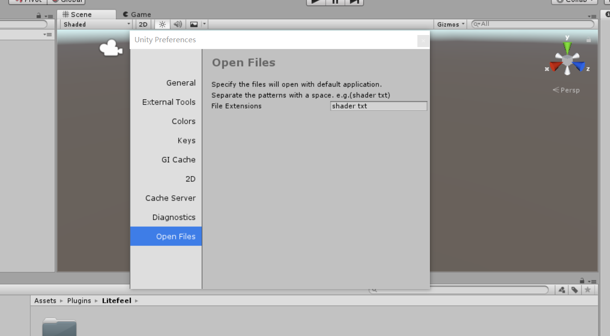

# Open Files With Default App

Open Files With Default App is just perfect Unity asset plugin to open file with system default Application.

#### Feature list:

* Open files with default application
* No runtime resources required
* No scripting required

##### How to use?

1. Import this plugin from [Asset Store](https://assetstore.unity.com/packages/slug/140433)
2. Open Windows from [Edit] > [Preferences…] > [Open Files]
3. Input the file extensions, like txt
4. Double click txt file, will open it with default application

#### Screenshot

#### Support
* Create issues by issues page (https://github.com/litefeel/OpenFilesWithDefaultApp/issues)
* Send email to me: litefeel@gmail.com
